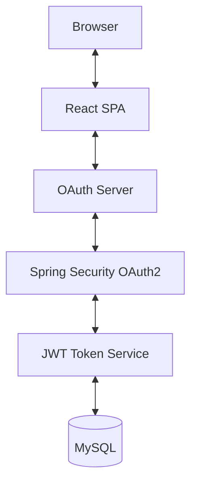

## Tech Stack

## Tech Stack

&nbsp;

&nbsp;;

&nbsp;

&nbsp;

&nbsp;

&nbsp;

&nbsp;

&nbsp;

### Backend
- Java 21
- Spring Boot
- Spring Security
- OAuth 2.0
- JWT Authentication

### Frontend
- React.js
- React Bootstrap
- SCSS

### Database
- MySQL

### Authentication
- Google OAuth2
- GitHub OAuth2
- JWT Access & Refresh Tokens

