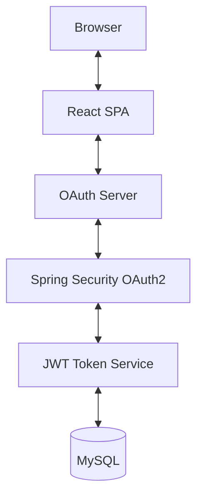

<h2 align="center">Tech Stack</h2>

  
  &nbsp;
  
  &nbsp;
  

  
  &nbsp;
  
  &nbsp;
  

  
  &nbsp;
  
  &nbsp;
  

### Backend
- Java 21
- Spring Boot
- Spring Security
- OAuth 2.0
- JWT Authentication

### Frontend
- React.js
- React Bootstrap
- SCSS

### Database
- MySQL

### Authentication
- Google OAuth2
- GitHub OAuth2
- JWT Access & Refresh Tokens

